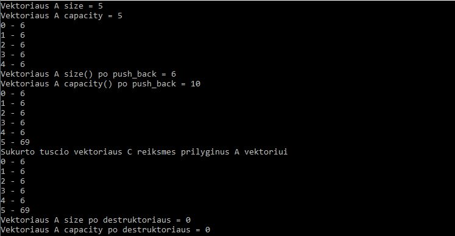

# Vectorius

# 1.

Įsitikinsime, kad Vector konteineris veikia (funkcionalumo prasme) lygiai taip pat, kaip ir std::vector. 

Tam atlikti panaudojome: konstruktorių, destruktorių, size(), capacity(), '=' operatorių, '[]' priėjimą prie elementų, push_back() funkcijas.

Rezultatai rodo, kad nuosavo vektoriaus visos funkcijos veikia taip pat ir std::vector.

# 2.
